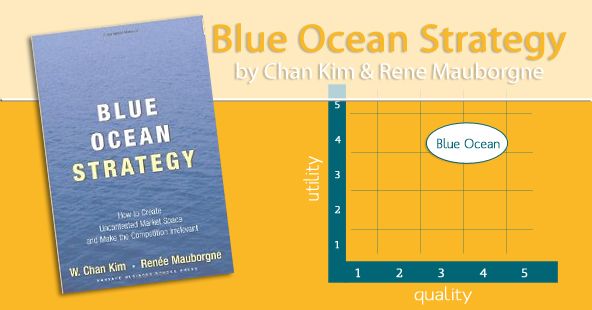

!SLIDE center

!SLIDE center

!SLIDE bullets
# Book Summary
* competitor-free markets that innovative companies can navigate

!SLIDE bullets
# Red Ocean
* explored and crowded with competitors

!SLIDE bullets
# Blue Ocean
* untapped market space
* opportunity for highly profitable growth

!SLIDE bullets
# Cocktail Party Statements
* Aaron: True strategy is
* **not** about **engaging in a bloody competition**
* but **creating a new customer** in uncharted territory.

!SLIDE bullets
# Cocktail Party Statements
* Karin: **Be different**.

!SLIDE bullets
# Cocktail Party Statements
* Phil: Avoid conflict at all costs.

!SLIDE bullets
# Cocktail Party Statements
* @leobessa: Unleash new market spaces through focus and divergence.