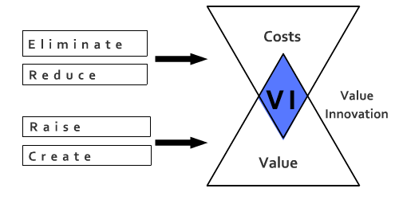

!SLIDE subsection
# Value Innovation

!SLIDE bullets
# Value Innovation
* Don't use the competion as your benchmark

!SLIDE bullets
# Value Innovation
* "If I’d asked people what they wanted, they would have said a faster horse." Henry Ford

!SLIDE bullets
# Value Innovation
* Utility
* Price
* Cost

!SLIDE bullets
# Value Innovation (if it fails)
* Market Pioneers
* Technology innovators

!SLIDE bullets
# Value-cost trade-off
* Greater Value @ Higher Cost
* Reasonable Value @ Lower Cost

!SLIDE bullets
# Value Innovation
* Differentiation
* AND
* Low Cost

!SLIDE bullets
# Value Innovation
* @ Cirque du Soleil
* Famous Clowns
* Lion Tamers

!SLIDE bullets
# Value Innovation
* @ Cirque du Soleil
* Thrill of the Circus
* Intellectual Sophistication
* Artistic Richness of Theater

!SLIDE bullets
# Key Factors
* @ Cirque du Soleil
* Tent
* Clowns
* Classic Acrobatics

!SLIDE center

!SLIDE bullets
# Value innovation
* is more than innovation
* it's about strategy

!SLIDE bullets
# Value innovation
* Leap in value
* for buyers
* AND
* for the company
