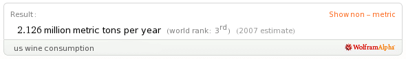

!SLIDE subsection
# Let's look at one industry

!SLIDE center
# U.S. wine industry

!SLIDE bullets
* $20 billion industry
* intensely competitive

!SLIDE smbullets
* California
* France
* Italy
* Spain
* Chile
* Australia
* Argentina

!SLIDE bullets
# Consolidation
* Top 8 (75%)
* 1600+ (25%)

!SLIDE bullets
# Hardly Attractive*
* intense competition
* price pressure
* increasing bargaining power
* ***in conventional thinking**