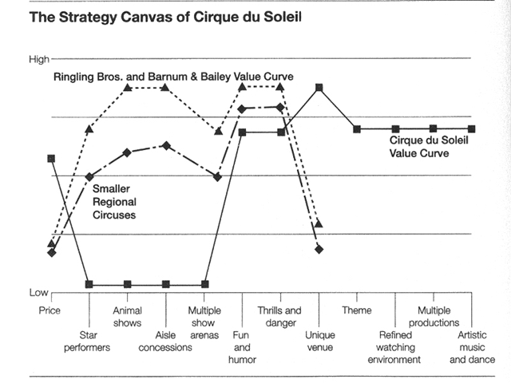

!SLIDE subsection
# The Strategy Canvas

!SLIDE bullets
# Purpose #1 of 2
* captures the current state of play

!SLIDE smbullets
# Key Factors
* Price
* Enological terminology/distinctions
* Above-the-line-marketing
* Aging quality
* Vineyard prestige and legacy
* Wine complexity
* Wine range

!SLIDE bullets
# High Offering level means
* Offers buyers more
* invests more

!SLIDE center

!SLIDE bullets
# Purpose #2 of 2
* **Reorientates your strategic focus**
* _competitors_ to _alternatives_
* _customers_ to _noncustomers_ of the industry

!SLIDE center
