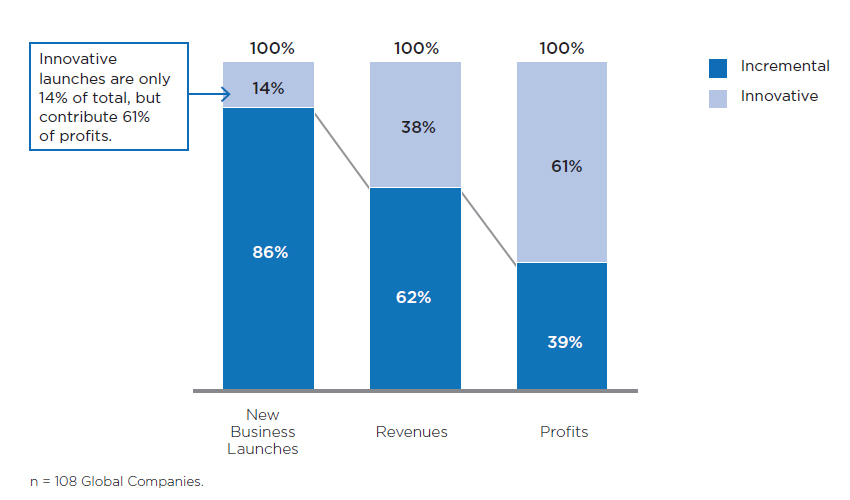

!SLIDE title-slide
# Creating Blue Oceans

!SLIDE bullets
# Think About
* declining industry
* limited potential growth
* supplier power was strong
* buyer power was strong

!SLIDE bullets
# Circus Industry - 1984
* declining industry
* limited potential growth
* supplier power was strong (star performers)
* buyer power was strong

!SLIDE bullets
# Alternative Entertainment
* sports events
* Playstation

!SLIDE bullets
# "We Reinvent the Circus"

!SLIDE bullets
# Cirque du Soleil
* created uncontested new market space
* adults and corporate clients

!SLIDE subsection
# Stop *trying* to beat the competion

!SLIDE bullets
# Red Oceans
* industry bondaries are defined and accepted
* rules of the game are known

!SLIDE bullets
# Blue Oceans
* untaped market space
* demand creation
* opportunity for highly profitable growth

!SLIDE center
# Q: Dominant focus of strategy (over the past 25 years)?

!SLIDE center
# A: red ocean strategies

!SLIDE subsection
# The Continuing Creation of Blue Ocean

!SLIDE bullets
# Look back 100 years
* How many of today's industries were then unkown?

!SLIDE bullets
* automobiles
* music recording
* aviation
* petrochemicals
* health care

!SLIDE bullets
# Look back 30 years
* How many of today's industries were then unkown?

!SLIDE smbullets
* mutual funds
* cell phones
* gas-fired eletricity plants
* biotechnology
* discount retail
* express package delivery
* minivans
* snowboards
* coffee bars
* home videos

!SLIDE bullets
# Look *forwards* 20 years
* What do you see?

<!-- !SLIDE bullets
# The language of strategy
* chief executive **officers**
* **headquatters**
* **troops**
* **front lines** -->

!SLIDE bullets
* confronting an opponent
* fighting over a given piece of land
* **limited** and **constant**

!SLIDE bullets
# Unlike war...
* market universe has never been constant

!SLIDE subsection
# The Impact of Creating Blue Oceans

!SLIDE center

!SLIDE bullets
#Unit of Analysis
* basic observable entity
* used to study and explain the success or failure of businesses over time

!SLIDE center
#Q: Are there _lasting_ "excellent" or "visionay" **companies** that continuosly outperform the market?

!SLIDE center
#The **strategic move** is the unit of analysis upon which the **logic**, **tools**, and **methodologies** of blue ocean strategy are derived.

!SLIDE subsection
# Value Innovation

!SLIDE bullets
# Value Innovation
* Don't use the competion as your benchmark

!SLIDE bullets
# Value Innovation
* "If I’d asked people what they wanted, they would have said a faster horse." Henry Ford

!SLIDE bullets
# Value Innovation
* Utility
* Price
* Cost

!SLIDE bullets
# Value Innovation (if it fails)
* Market Pioneers
* Technology innovators

!SLIDE bullets
# Value-cost trade-off
* Greater Value @ Higher Cost
* Reasonable Value @ Lower Cost

!SLIDE bullets
# Value Innovation
* Differentiation
* AND
* Low Cost

!SLIDE bullets
# Value Innovation
* @ Cirque du Soleil
* Famous Clowns
* Lion Tamers

!SLIDE bullets
# Value Innovation
* @ Cirque du Soleil
* Thrill of the Circus
* Intellectual Sophistication
* Artistic Richness of Theater

!SLIDE bullets
# Key Factors
* @ Cirque du Soleil
* Tent
* Clowns
* Classic Acrobatics

!SLIDE center
# Figure 1-2

!SLIDE bullets
# Value innovation
* is more than innovation
* it's about strategy

!SLIDE bullets
# Value innovation
* Leap in value
* for buyers
* AND
* for the company

!SLIDE center
# Figure 1-3

!SLIDE center
# Figure 1-4